# Du Bois Custom-Viz Gallery

A comprehensive **Databricks AI/BI dashboard** gallery showcasing ~171 chart types
styled with the [Du Bois design system](https://www.databricks.com/blog/introducing-du-bois)
palette. It covers essentially the entire *feasible*
[Vega-Lite example gallery](https://vega.github.io/vega-lite/examples/) as
production-ready AI/BI widgets, plus a companion dashboard demonstrating every
native (out-of-the-box) widget type — all laid out in a clean 2-column grid.

## Screenshots

### Bar & Column
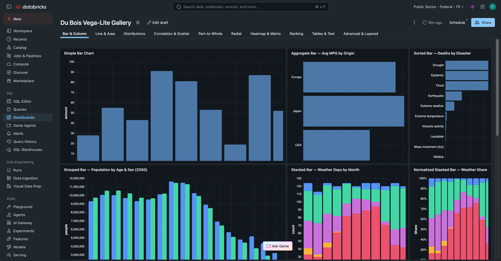

### Indicators & Dials
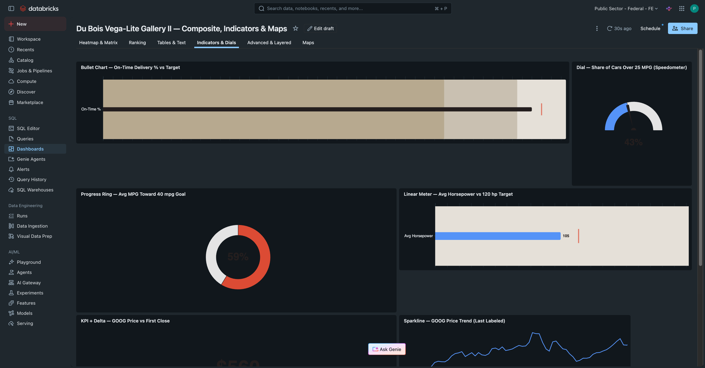

### Maps — Filled Choropleths
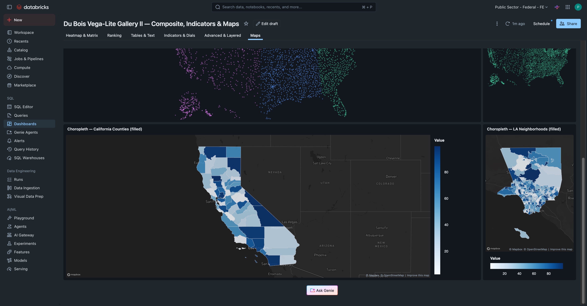

### Radial Charts
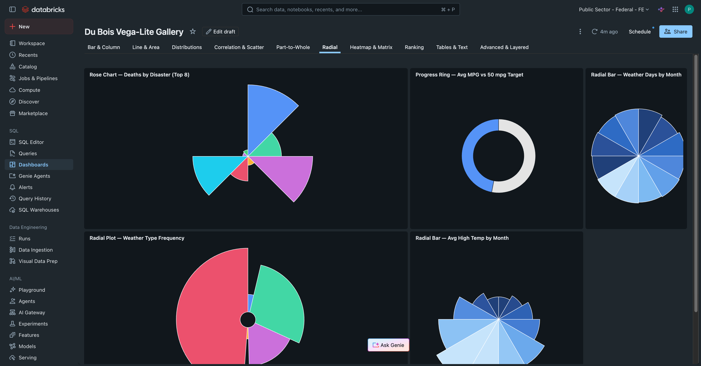

### Advanced & Layered
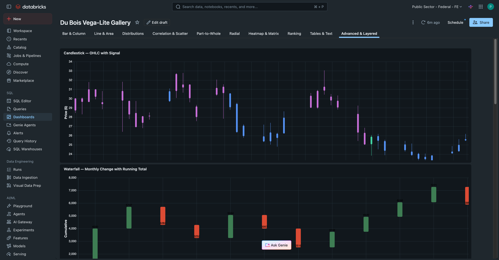

### Themed Dashboard Examples

The gallery's theming system (`uiSettings.theme` + Vega-Lite `config`) can reskin
the entire dashboard. These example themes show the same charts with completely
different palettes:

| Theme | Screenshot |
|-------|------------|
| 🖥️ The Matrix | 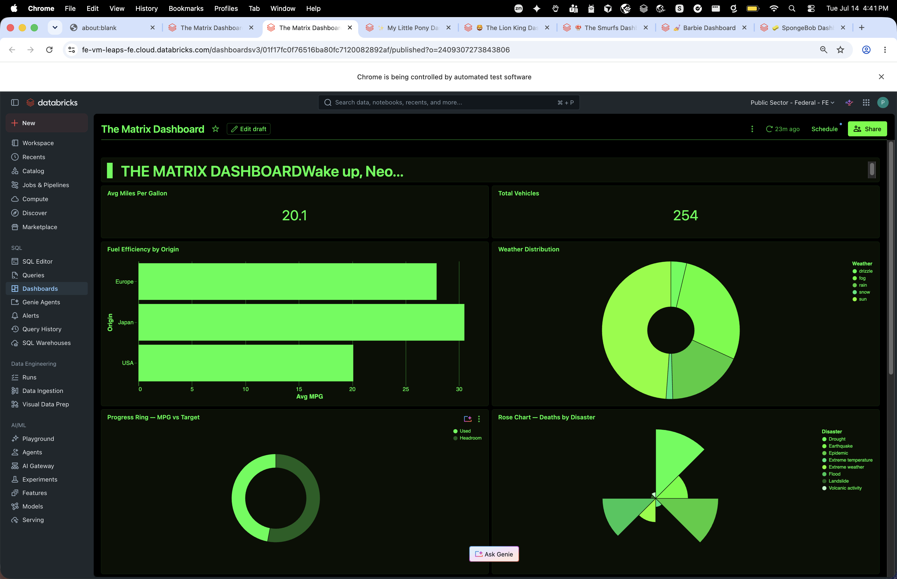 |
| 🦄 My Little Pony | 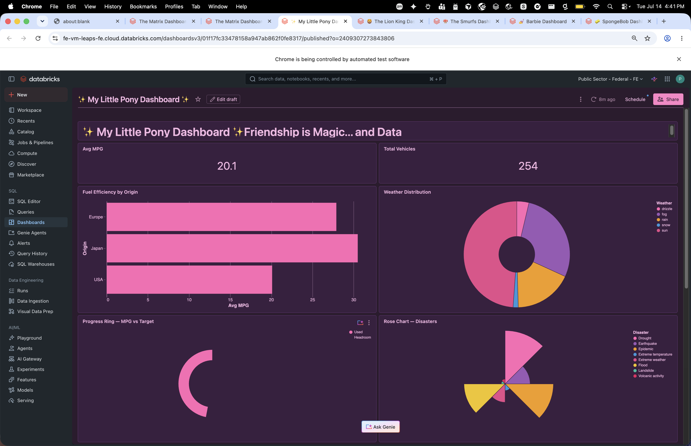 |
| 🦁 The Lion King | 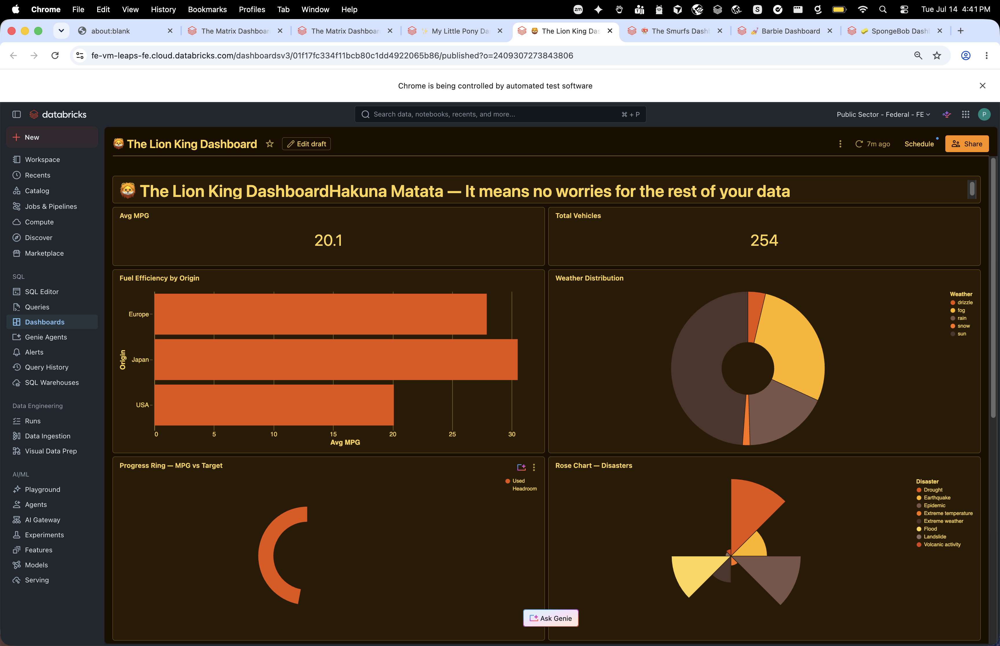 |
| 🍄 The Smurfs | 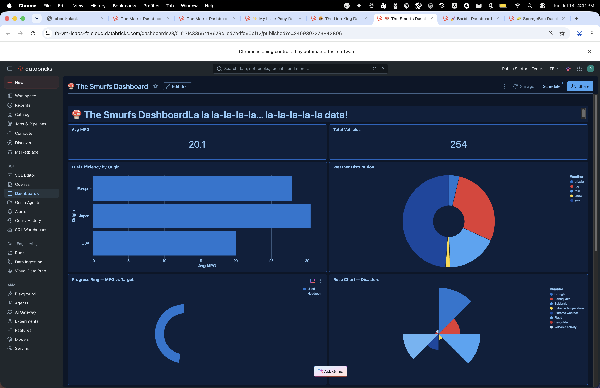 |
| 💅 Barbie | 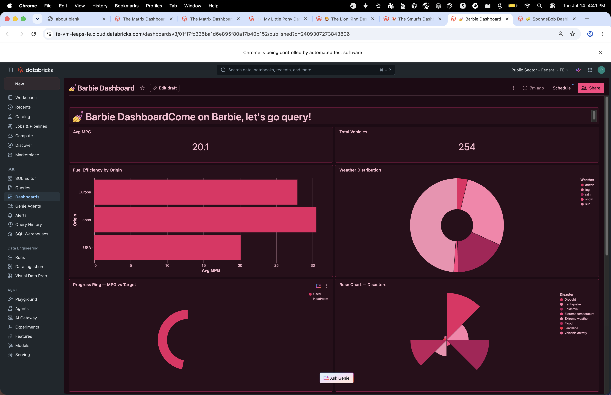 |
| 🧽 SpongeBob | 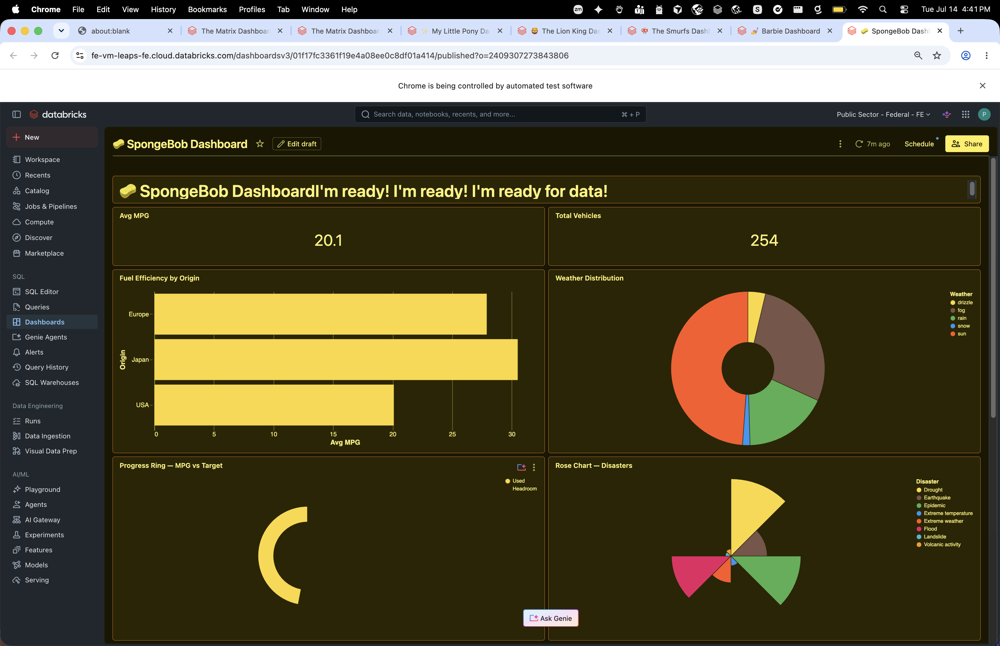 |

## What's here

| Path | Description |
|------|-------------|
| `palette/dubois.py` | Du Bois design-system tokens (categorical, sequential, diverging, status, surfaces) + Vega-Lite `config` and dashboard `theme` helpers. |
| `specs/` | Vega-Lite spec library organized by category. Each spec is Du Bois-styled and binds to `{"data": {"name": "databricks_query"}}`. |
| `build/build_dashboard.py` | Assembles the tabbed AI/BI dashboards from the spec library via the Lakeview REST API and publishes them. |
| `data_generation/` | Notebook that generates canonical Vega datasets into Unity Catalog, plus a script that builds GeoJSON geometry tables for choropleths. |
| `install.sh` | One-command installer: generates data, builds geometry, creates + publishes all three dashboards. |
| `docs/` | Architecture notes and screenshots. |

## The dashboards

Three dashboards, ~171 charts total, deployed in a **2-column layout** (`w=3+w=3`
on the 6-column AI/BI grid):

| Dashboard | Tabs | Charts | Description |
|-----------|------|--------|-------------|
| **Gallery I — Core Charts** | 6 | 109 | Bar & Column, Line & Area, Distributions, Correlation & Scatter, Part-to-Whole, Radial |
| **Gallery II — Composite** | 6 | 62 | Heatmap & Matrix, Ranking, Tables & Text, Indicators & Dials, Advanced & Layered, Maps |
| **Out-of-the-Box (Native)** | 1 | 21 | Every native AI/BI widget type: counter, bar, line, area, pie, scatter, heatmap, box, histogram, table, symbol-map, choropleth-map, sankey, gantt, funnel, waterfall, combo, pivot, forecast-line |

### Chart coverage by tab

| Dash | Tab | # | Highlights |
|------|-----|---|------------|
| I | Bar & Column | 27 | Simple, aggregate, sorted, grouped (`xOffset`), stacked/normalized, layered, highlight, labels, mean-rule, gantt, data-color, population pyramid, likert |
| I | Line & Area | 26 | Multi/step/monotone line, area/stacked/normalized/streamgraph/gradient/band/horizon, bump, trail, stroke-dash |
| I | Distributions | 22 | Histogram/binned/log, cumulative, density (+grouped), 2D histogram, boxplot/tukey, strip, mean±CI/stddev |
| I | Correlation & Scatter | 20 | Colored/filled scatter, bubble, regression, loess, log-scale, binned, connected, jitter, parallel coords |
| I | Part-to-Whole | 9 | Pie (+labels), donut, % labels, radius-arc, pyramid pie, normalized bar |
| I | Radial | 5 | Rose, progress ring, radial bars, radial plot |
| II | Heatmap & Matrix | 9 | Temp heatmap, punchcard, calendar, genre×rating, count matrix, lasagna, annual |
| II | Ranking | 7 | Top-N bars, lollipop, dot plot, labels, sorted, diverging |
| II | Tables & Text | 7 | Heatmap-table, KPI big-number, bar-in-table, colored-text, text grid, mosaic |
| II | Indicators & Dials | 7 | Bullet, speedometer dial (needle), progress ring, linear meter, KPI + delta, sparkline, stat-row |
| II | Advanced & Layered | 26 | Candlestick, waterfall, bar+line, ranged dot, error bars/CI band, slope, annotation, diff-from-avg, top-K |
| II | Maps | 6 | Airport dot / per-state bubble / region symbol maps + filled California-county and LA-neighborhood choropleths |

### Native OOTB vs Custom Viz

- **Custom Viz** (`custom-vega-viz`): Vega-Lite specs authored in this repo —
  everything in Gallery I & II. Titles show the chart name only.
- **Native / Out-of-the-Box**: AI/BI's built-in widget types. The entire third
  dashboard. Titles are prefixed with `◆` and tagged with the widget type:
  `◆ <title>  ·  OOTB native (<widgetType>)`.

Why the maps split: custom-viz `geoshape` does *not* render filled polygons in the
AI/BI sandbox, so filled choropleths use the **native `choropleth-map` widget**
(reads geometry from a `geojson` column via `region.regionType=custom`). Point/symbol
maps still work as custom-viz using the `albersUsa` projection.

### Out of scope

- **Interactive** (brush, pan/zoom, cross-filter, selection) — a published widget is static
- **Faceting / Trellis / Repeat / Concatenation** — multi-view specs don't size in container widgets
- 2 charts excluded via `EXCLUDE_IDS` because they didn't render cleanly

## Quick start

### Prerequisites

- [Databricks CLI](https://docs.databricks.com/dev-tools/cli/) (v0.2xx+) authenticated for your workspace
- `python3`
- A running SQL warehouse
- Serverless jobs enabled (for the one-time data-generation run)

### Install (any workspace)

```bash
./install.sh --profile <cli-profile> --warehouse <warehouse-id>
```

Options:
- `--schema <catalog.schema>` — target schema (default: `pb_demo.custom_gallery`)
- `--parent-path /Users/<you>` — workspace folder for dashboards (default: calling user's home)
- `--mode dark|light` — Du Bois palette mode (default: `dark`)

The installer is **idempotent per workspace** — re-running updates the same dashboards.
Dashboard IDs are tracked in `~/.dubois-vega-gallery/ids-<profile>.json` so each
workspace gets its own set.

### What the installer does

1. Imports `data_generation/00_generate_vega_datasets.ipynb` into the workspace
2. Runs it as a serverless job (creates the schema + ~20 tables)
3. Builds GeoJSON geometry tables for filled choropleths
4. Builds + publishes all three dashboards via the Lakeview REST API

### Manual steps

```bash
export VEGA_SCHEMA=main.my_gallery    # any catalog.schema you can write to

# 1. Upload and run the data notebook (creates schema + tables)
#    data_generation/00_generate_vega_datasets.ipynb

# 2. Build geometry tables for choropleths
python3 data_generation/10_generate_geo_tables.py \
  --profile <p> --warehouse <id> --schema $VEGA_SCHEMA

# 3. Build + publish all three dashboards
python3 build/build_dashboard.py \
  --profile <p> --warehouse <id> --schema $VEGA_SCHEMA \
  --parent-path /Users/<you>
```

## How it works

### Chart → Widget pipeline

Each chart in `specs/<category>.py` defines:
- `id`, `title` — unique identifier and display name
- `sql` — dataset query over a table in the target schema
- `fields` — columns the Vega-Lite spec references
- `spec` — the Vega-Lite spec (no `$schema`/`data`/`width`/`height`/`config` — the build injects these)
- `w`, `h` — grid size (6-column grid; default `w=3` = half width, two per row)

The build script (`build/build_dashboard.py`) assembles each chart into:
1. A **dataset** (SQL query)
2. A **widget** — either `custom-vega-viz` (Vega-Lite wrapped) or a **native** widget (choropleth-map, etc.)

Native charts set `"native": {...}` + `"query_fields": [...]` instead of `"spec"` + `"fields"`.

### Grid system

AI/BI dashboards use a **6-column grid** (undocumented by Databricks):

| Layout | Positions |
|--------|-----------|
| 2 equal columns | `x=0, w=3` + `x=3, w=3` |
| Full width | `x=0, w=6` |
| 3 equal columns | `x=0, w=2` + `x=2, w=2` + `x=4, w=2` |

### Du Bois styling

`palette/dubois.py` provides:
- **`dubois_config(mode)`** — Vega-Lite `config` block applied to every custom-viz spec
  (color ranges, recessive grid, rounded bars, fonts)
- **`dubois_theme()`** — AI/BI dashboard theme (`uiSettings.theme`) so native widgets
  also render in the Du Bois palette (categorical series order, canvas/widget surfaces)

### Dashboard splits

The gallery spans **two** dashboards because each dashboard can hold at most 100 datasets.
Identical SQL queries are deduped to one dataset. The third dashboard holds all native
(OOTB) widgets.

## Architecture

See [`docs/ARCHITECTURE.md`](docs/ARCHITECTURE.md) for:
- The exact `custom-vega-viz` widget JSON shape
- Native `choropleth-map` and `symbol-map` schemas
- Flow/hierarchy widget schemas (sankey, gantt, funnel, waterfall, combo, pivot, forecast-line)
- Dashboard theming details

## Spec authoring

See [`specs/_REFERENCE.md`](specs/_REFERENCE.md) for rules, hard constraints, available
tables, and worked examples. See [`specs/_SLUGS.md`](specs/_SLUGS.md) for the complete
Vega-Lite slug list and feasibility notes.

## License

Internal use. Not for external distribution.
